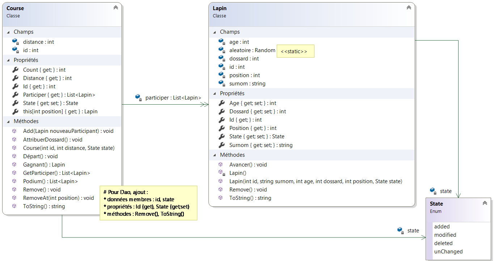
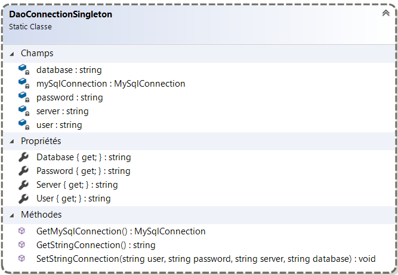
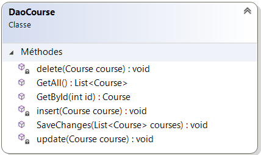
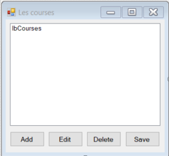
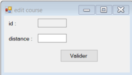
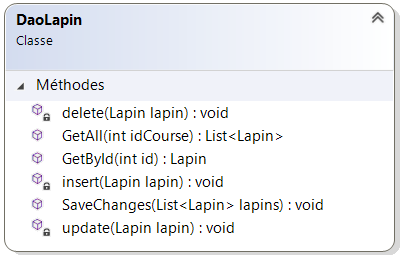
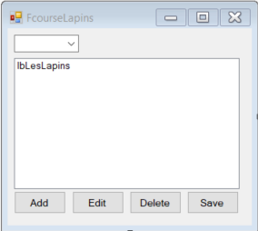
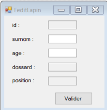

# Ajout de l'accès aux données à des classes métiers 

## 1. Mise en place des classes

* model : représente les classes métiers, la logique métier de la programmation
* dao : permet d'organiser la persistance des données dans une base de données. D'autres
choix techniques auraient pu être envisagés (fichier texte, json, csv...)
* view : les vues représentent l'interface utilisateur de l'application. Elles sont réalisées
en fonction des maquettes écrans proposées ainsi que des cas d'utilisation retenus.

```plantuml
@startuml cas d'utilisation
Organisateur as Organisateur
rectangle UltraTrail {
    Organisateur -- (Ajouter Course)
    Organisateur -- (Modifier Course)
    Organisateur -- (Supprimer Course)
    Organisateur -- (Inscrire des Lapins à une course)
    (Inscrire des Lapins à une course)..>(Sélectionner une course):<<include>>
    (Inscrire des Lapins à une course)<..(Désincrire):<<extends>>
    (Inscrire des Lapins à une course)<..(Modifier l'inscription):<<extends>>
    (Inscrire des Lapins à une course)<..(Supprimer une inscription):<<extends>>    
}
note top of (Inscrire des Lapins à une course)
  1. l'utilisateur sélectionne une course
  2. la liste des lapins participants est affichée
  
  <u>scénarios inclus</u>
  l'utilisateur peut ajouter un participant
  l'utilisateur peut supprimer un participant
  l'utilisateur peut modifier un participant
  
  3. l'utilisateur Valide ses modifications
end note
@enduml
```

Le modèle est à récupérer des tp précédents, les classes du dao sont à coder. On vous fournit un exemple pour DaoCourse, DaoLapin est à coder. Le code de la classe de connection vous est fourni.
Pour les vues, vous avez un exemple permettant de gérer entièrement les vues de `Course`. Les vues sur la classe `Lapin` sont à coder.
Toutes les maquettes écran vous sont fournies.

Les projets Model et Dao doivent être compilés sous forme de dll. Les références doivent être ajoutées dans la vue.

<div style="page-break-after: always;"></div>

## 2. Adapter le modèle métier :



Ajouter les propriétés et méthodes suivantes dans chaque classe métier
* id {get;set}
* state {get;set}
* Remove()
* prévoir une méthode ToString affichant les informations sur une seule ligne. Pensez à afficher l'état de l'occurence
* Modifier le constructeur de lapin et course pour respecter les signatures proposées.
* un script de création de la base de données vous est proposé dans le répertoir bd `[script bd](./bd/CreateDbUtdl.sql)`

```csharp
public void Remove() {
    this.state = State.deleted;
}
```

Prévoir une énumération
Celle-ci permet de qualifier l'état d'une instance, en lien avec la couche Dao.

```csharp
public enum State { added, modified, deleted, unChanged };
```

<div style="page-break-after: always;"></div>

## 3. Classes d'accès aux données

Permet de définir une couche (logiciel) d'accès aux données. Elle permet de rendre indépendant la couche métier de la couche de persitance.

### Dao Connection

Permet la connexion à n'importe quelle base de données. C'est une classe static, son accesseur GetMySqlConnection garantit qu'il n'existera qu'une seule instance de connexion à la base de données.



### Dao Course



## 4. Vues sur les courses

### La liste des courses

> voici le code permettant d'afficher la liste des courses en utilisant le dao sur les courses.



On met en place ce que l'on nomme crud :
- create
- read 
- update
- delete 
Généralement on s'oblige à créer un crud sur toutes les tables gérées en base de données. De manière à donner accès au maitre d'ouvrage à toutes les données gérées par le système développé.

```csharp
public partial class FlesCourses:Form {
    public FlesCourses() {
        InitializeComponent();
        btnAdd.Click += this.btnAdd_Click;
        btnEdit.Click += this.btnEdit_Click;
        btnDelete.Click += this.btnDelete_Click;
        btnSave.Click += this.btnSave_Click;
        this.load(new DaoCourse().GetAll());
    }

    private void btnSave_Click(object sender,System.EventArgs e) {
        List<Course> courses = new List<Course>();
        foreach(object o in lbCourses.Items) {
            courses.Add((Course)o);
        }
        new DaoCourse().SaveChanges(courses);
        this.load(courses);            
    }
```

<div style="page-break-after: always;"></div>

```csharp
    private void btnDelete_Click(object sender,System.EventArgs e) {
        if(lbCourses.SelectedIndex == -1) return;
        int position = lbCourses.SelectedIndex;
        ((Course)lbCourses.Items[position]).Remove();
        lbCourses.Items[position] = lbCourses.Items[position];
    }

    private void btnEdit_Click(object sender,System.EventArgs e) {
        if(lbCourses.SelectedIndex == -1) return;
        int position = lbCourses.SelectedIndex;
        FeditCourse fEdit = new FeditCourse(State.modified,lbCourses.Items,position);
        fEdit.Show();
    }

    private void btnAdd_Click(object sender,System.EventArgs e) {
        FeditCourse fEdit = new FeditCourse(State.added,lbCourses.Items,0);
        fEdit.Show();
    }

    private void load(List<Course> courses) {
        lbCourses.Items.Clear();
        foreach(Course c in courses) {
            lbCourses.Items.Add(c);
        }
    }
}
```

### La fenêtre permettant de créer/modifier une course



<div style="page-break-after: always;"></div>

```csharp
public partial class FeditCourse:Form {
    State state;
    ListBox.ObjectCollection items;
    int position;

public FeditCourse(State state,ListBox.ObjectCollection items,int position) {
    InitializeComponent();
    btnValider.Click += this.btnValider_Click;
    this.state = state;
    this.items = items;
    this.position = position;
    switch(state) {
        case State.added:
            this.Text = "Création d'une course";
            break;
        case State.modified:
            Course course = (Course)items[position];
            this.tbId.Text = course.Id.ToString();
            this.tbDistance.Text = course.Distance.ToString();
            this.Text = "Modification d'une course";
            break;
        case State.deleted:
            this.Text = "Suppression d'une course";
            break;
        case State.unChanged:
            this.Text = "Consultation d'une course";
            break;
        default:
            break;
    }
}
```

 <div style="page-break-after: always;"></div>

 ```csharp
 private void btnValider_Click(object sender,EventArgs e) {
    switch(this.state) {
        case State.added:
            items.Add(new Course(0,Convert.ToInt32(this.tbDistance.Text),this.state));
            break;
        case State.modified:
            Course course = (Course)items[this.position];
            course.Distance = Convert.ToInt32(this.tbDistance.Text);
            course.State = this.state;
            items[this.position] = course;
            break;
        case State.deleted:
            break;
        case State.unChanged:
            // rien
            break;
        default:
            break;
    }
    this.Close();
    }
}
```

> à vous de coder pour la classe lapin : 

- le modèle objet d'accès aux données,
- La liste des lapins participants à une course,
- La modification/Création d'une participation.

## 5. Dao Lapin



- attention à la méthode `GetAll(..)` qui attend dans ce cas un paramètre.

<div style="page-break-after: always;"></div>

## 6. Vues sur la class Lapin 

### La liste des lapins participants à une course



### La modification/Création d'une participation

 

## 7. Gérer la génération de l'id dans la base de données

Vous avez peut être remarqué que lorsque l'on crée une nouvelle course ou un nouveau lapin, on ne récupère pas l'id de celui-ci. 

Proposez une évolution permettant de résoudre ce petit problème.

indice 1 : l'évolution est liée à une propriété du SqlCommand (LastInsertId) que l'on peut utiliser lors que l'on effectue un Insert.

Enstso Janvier

enstso@outlook.fr